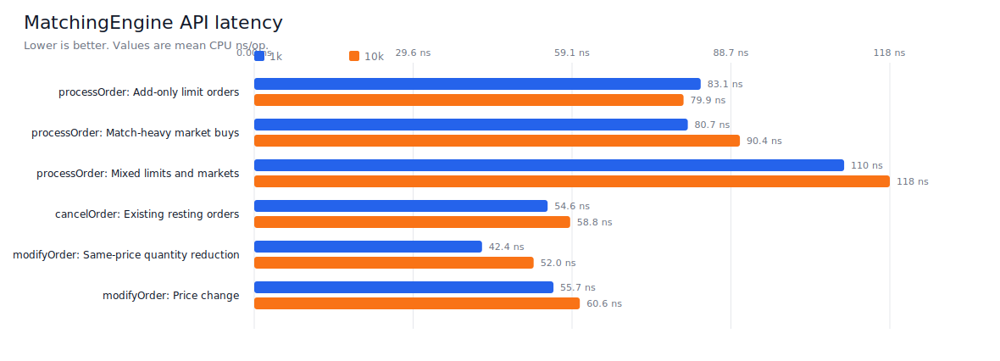
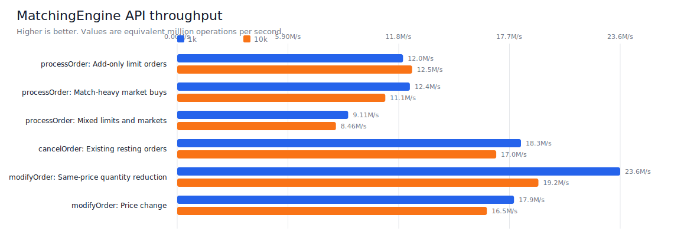
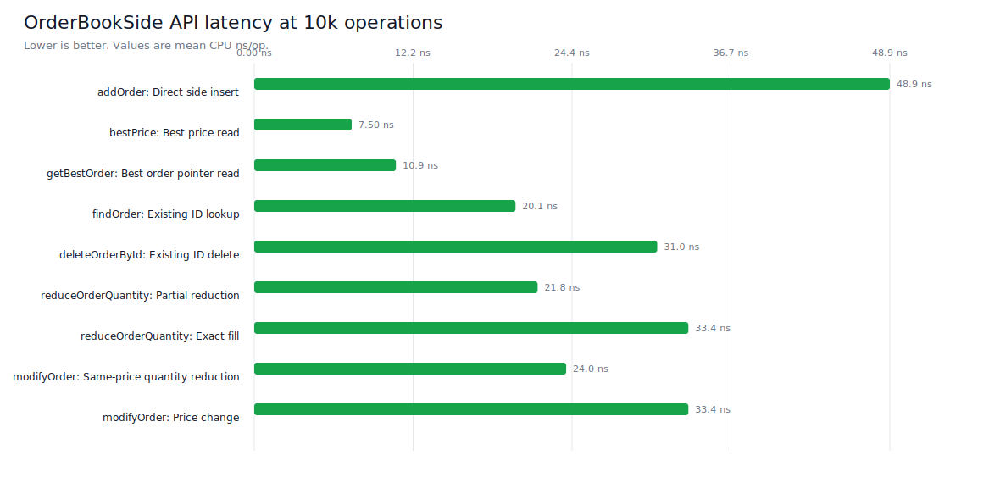
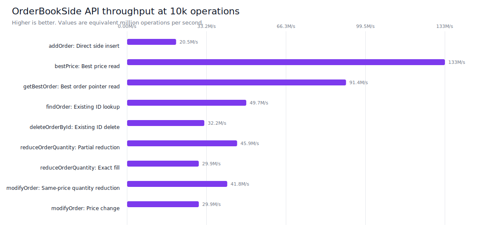
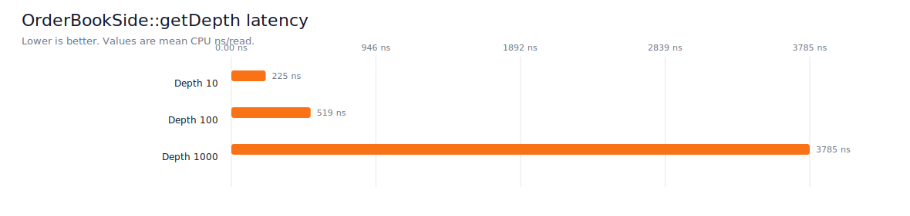
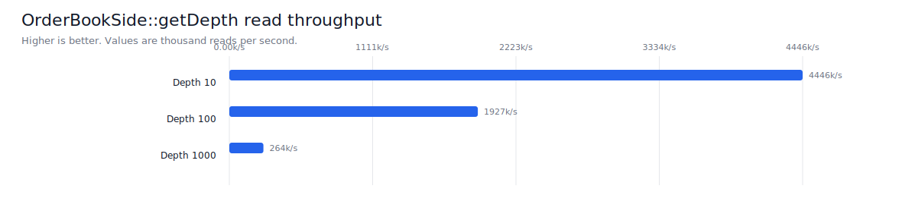

# Limit Order Book (C++)
[](https://github.com/nitant-p/order-book/actions/workflows/ci.yml)
[](https://github.com/nitant-p/order-book/actions/workflows/coverage.yml)

High-performance C++ matching engine and order book implementation for exchange-style trade simulation.

## Overview
This project implements a central limit order book (CLOB) with deterministic matching behavior, order lifecycle operations, and automated validation through unit tests and CI.

## Core Features
- Supports `BUY` and `SELL` sides.
- Supports `LIMIT` and `MARKET` order types.
- Enforces price-time priority within price levels (FIFO queue per level).
- Multi-level matching across the book until fill or stop condition.
- Best-price execution:
- Incoming buys match lowest available asks first.
- Incoming sells match highest available bids first.
- Partial fill handling for both incoming and resting orders.
- Automatic cleanup of empty price levels after fills/cancels.
- Engine-managed monotonic `uint64_t` order IDs.
- Order lifecycle API includes `processOrder(side, type, price, quantity)`.
- Order lifecycle API includes `cancelOrder(orderId)`.
- Order lifecycle API includes `modifyOrder(orderId, newPrice, newQuantity)`.
- Trade capture per processed order (returns `std::vector<Trade>`).

## Architecture
- Matching engine: [`MatchingEngine.h`](./include/MatchingEngine.h), [`MatchingEngine.cpp`](./src/MatchingEngine.cpp)
- Order model: [`Order.h`](./include/Order.h)
- Trade model: [`Trade.h`](./include/Trade.h)
- Test suite: `tests/` (category-based fixtures)

The engine owns two independent order books, one for bids and one for asks. The engine handles order processing, matching, cancellation, modification, trade capture, and ID-side routing; each `OrderBookSide` owns its own price levels and borrows active order nodes from a shared `OrderNodePool`.


Each order book stores price levels in `std::map<int, PriceLevel>`. Conceptually this is an ordered binary tree keyed by price. A `PriceLevel` stores aggregate level metadata and points to the head and tail of its FIFO order-node queue.


Each order book also stores active orders by ID in `std::unordered_map<uint64_t, OrderNode*>`. The map indexes borrowed nodes; `OrderNodePool` owns the reusable node storage. The nodes link to each other as a doubly linked list, and each node points back to its `PriceLevel`.


## Build
```bash
cmake -S . -B build -DBUILD_TESTING=ON
cmake --build build
```

Run executable:
```bash
./build/order_book
```

## Test
```bash
ctest --test-dir build --output-on-failure
```

## Test Categories
The suite is organized by behavior category:

- `BestMatchingBySideTest`: best-price matching and price-time behavior for buy/sell matching loops.
- `OrderTypeBehaviorTest`: limit vs market semantics and liquidity edge cases.
- `CancelOrderTest`: cancel API behavior, queue cleanup, and non-mutation guarantees.
- `ModifyOrderTest`: modify API behavior, priority impacts, and invalid input handling.
- `OrderIdBehaviorTest`: engine-generated monotonic/unique order ID behavior.

Run a single category:
```bash
ctest --test-dir build -R ModifyOrderTest --output-on-failure
```

## V1 Benchmark Results
This section is the V1 benchmark baseline. Charts are generated from [`docs/benchmark_results_v1.csv`](./docs/benchmark_results_v1.csv) using a dependency-free Python SVG generator:

```bash
python3 scripts/generate_benchmark_graphs.py
```

To generate charts for another benchmark CSV:

```bash
python3 scripts/generate_benchmark_graphs.py docs/benchmark_results_v2_pool.csv docs/benchmark_graphs_v2_pool
```

Build and run the Google Benchmark executable:

```bash
cmake -S . -B build -DBUILD_TESTING=ON -DBUILD_GOOGLE_BENCHMARKS=ON -DCMAKE_BUILD_TYPE=Release
cmake --build build --target order_book_google_benchmark --parallel
./build/order_book_google_benchmark --benchmark_repetitions=3 --benchmark_report_aggregates_only=true
```

The benchmark build disables hot-path console logging with `ORDER_BOOK_DISABLE_LOGGING`, so `processOrder` and related timed paths are not dominated by `std::cout`.

### MatchingEngine APIs


Findings:
- `processOrder` add-only still pays for node allocation and price-level map updates, but order-ID indexing is now average O(1).
- Match-heavy `processOrder` remains competitive because market orders remove resting liquidity instead of growing the book.
- Mixed flow performs best among the engine order-processing cases because it combines passive adds with liquidity removal.
- `cancelOrder` benefits from average O(1) side-level order lookup before unlinking the node.
- Same-price `modifyOrder` is faster than price-change modify because it preserves queue position and avoids relinking across price levels.

### OrderBookSide APIs


Findings:
- Direct `OrderBookSide` calls are faster than equivalent `MatchingEngine` paths because they skip engine orchestration, trade handling, and side routing.
- `bestPrice` and `getBestOrder` are the cheapest read paths.
- `findOrder` is faster after moving `orderNodesById_` to `std::unordered_map`.
- Partial `reduceOrderQuantity` and same-price `modifyOrder` are the fastest write-style operations because the order stays in place.
- Exact-fill reduction is slower than partial reduction because it also removes the order node and may clean up the price level.
- Price-change modify is slower than same-price modify because it relinks the order into another level.

### Depth Snapshots


Findings:
- `getDepth(10)` is reasonable for shallow display-style snapshots.
- `getDepth(100)` scales up visibly because it walks more levels and writes more `LevelSnapshot` entries.
- `getDepth(1000)` is the slowest measured side API because it materializes a large snapshot vector.
- Depth benchmarks should be compared separately from order mutation benchmarks because they are read-heavy and allocation-sensitive.

## V2 Pool Benchmark Results
This section captures the pooled-node implementation. New results are in [`docs/benchmark_results_v2_pool.csv`](./docs/benchmark_results_v2_pool.csv), with raw Google Benchmark JSON in [`docs/benchmark_results_v2_pool_raw.json`](./docs/benchmark_results_v2_pool_raw.json). Charts are generated into [`docs/benchmark_graphs_v2_pool/`](./docs/benchmark_graphs_v2_pool/).

The pooled run used the same benchmark cases and capacities as the current benchmark executable: 1k, 10k, 100k, and 1M operations where defined, plus the existing depth snapshot sizes.

### Pooled MatchingEngine APIs




### Pooled OrderBookSide APIs




### Pooled Depth Snapshots




### Pooling Impact
Compared with the V1 CSV, the pooled implementation improves all common measured rows. Across the 33 directly comparable V1 rows, mean latency improved by about 29%.

Selected 10k comparisons:

| Case | V1 ns/op | Pooled ns/op | Improvement |
| --- | ---: | ---: | ---: |
| MatchingEngine add-only `processOrder` | 126.1 | 79.9 | 36.6% |
| MatchingEngine `cancelOrder` | 92.4 | 58.8 | 36.4% |
| OrderBookSide `addOrder` | 70.8 | 48.9 | 30.9% |
| OrderBookSide exact-fill reduction | 48.6 | 33.4 | 31.3% |
| OrderBookSide same-price modify | 38.2 | 24.0 | 37.2% |

The main benefit is that hot order lifecycle paths no longer repeatedly allocate and destroy individual `OrderNode` objects. Inserts acquire a preallocated slot, cancels and exact fills return the slot, and modifications keep the same node while relinking when needed. Read-heavy paths such as `bestPrice`, `getBestOrder`, and `getDepth` see smaller or indirect improvements because they are dominated by map traversal, pointer access, or snapshot construction rather than node allocation.

## CI/CD
- CI workflow: [`.github/workflows/ci.yml`](./.github/workflows/ci.yml)
- Coverage workflow: [`.github/workflows/coverage.yml`](./.github/workflows/coverage.yml)
- Runs on every push and pull request.
- Coverage artifacts (`.gcov` + summary) are uploaded in the Coverage workflow.
