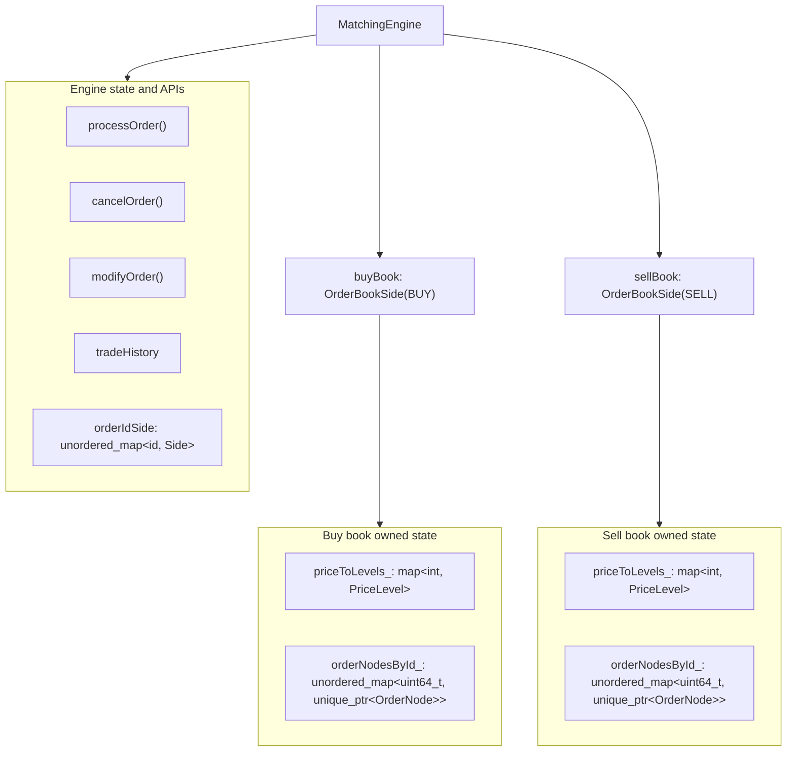
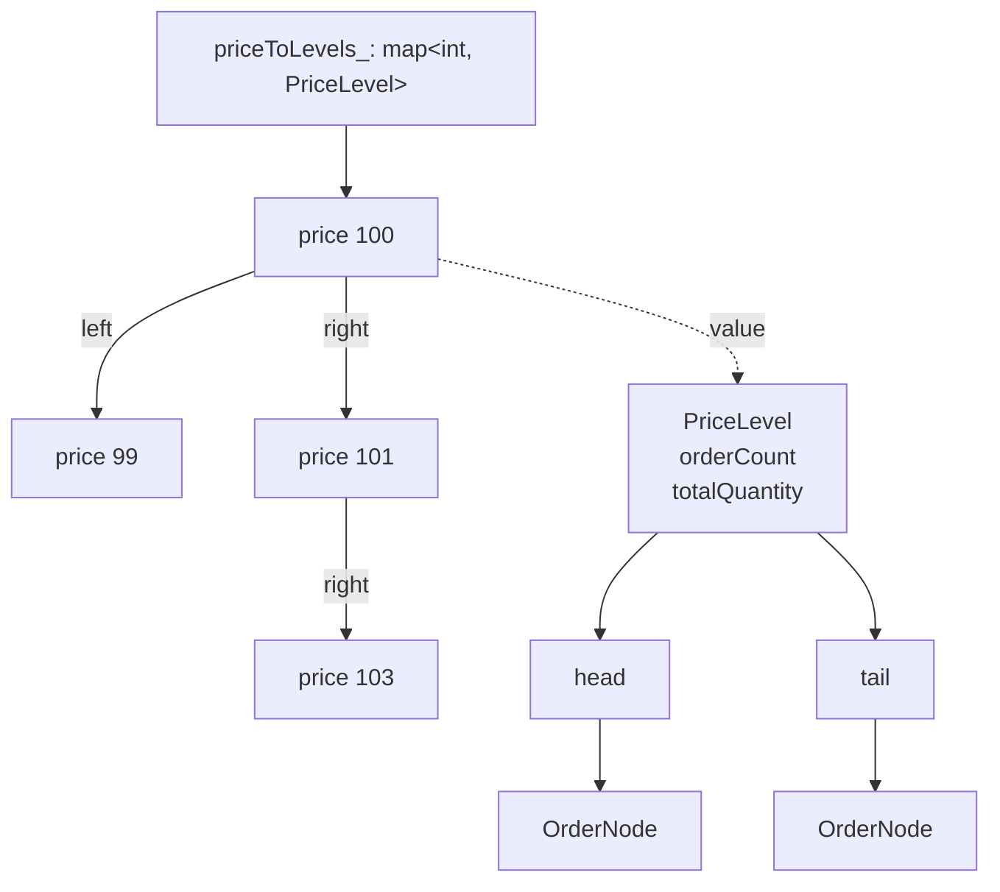
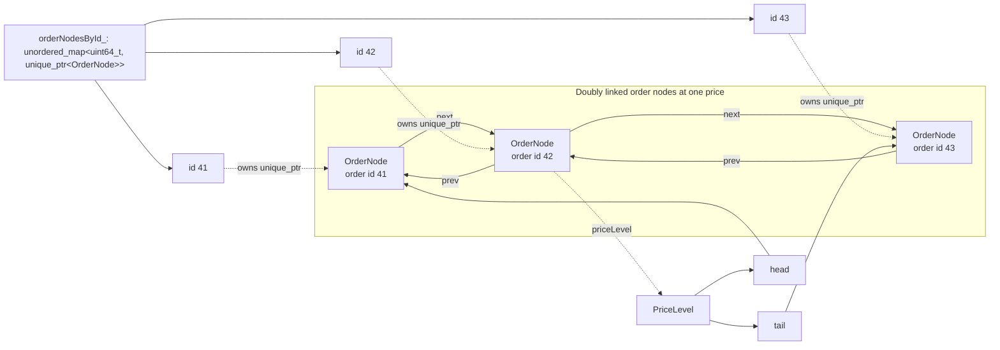

# Architecture Diagrams

This directory contains rendered architecture diagrams used by the root README, plus the Mermaid source used to regenerate them.

## Matching Engine

## Price Levels

## Order Nodes

